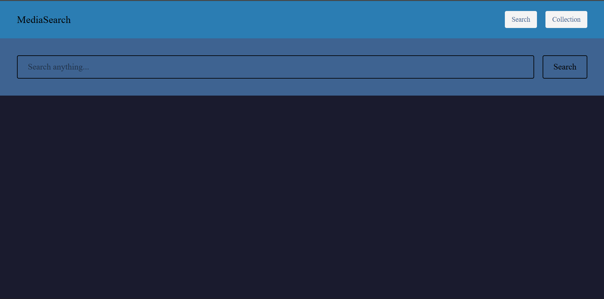
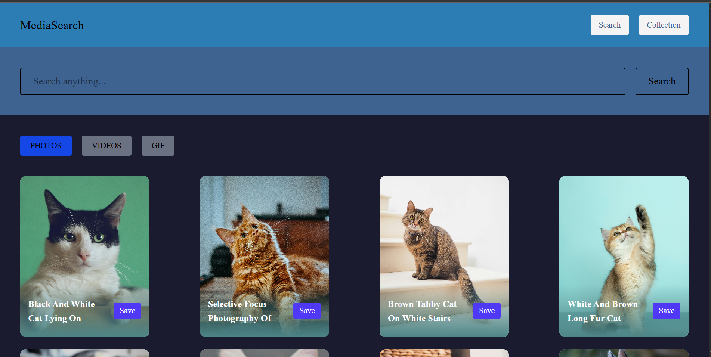
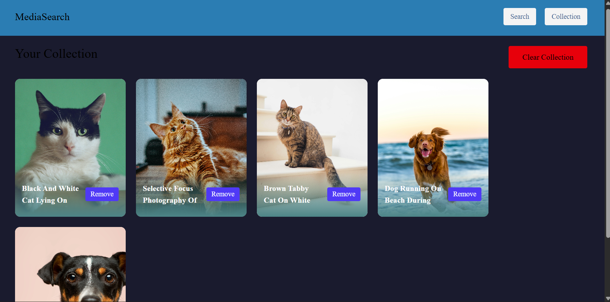

# 🎯 MediaSearch – Professional Media Discovery Platform

MediaSearch is a modern and elegant media discovery platform built using **React**, **Redux Toolkit**, and **TailwindCSS**.  
It allows users to search Photos, Videos, and GIFs using the Pexels API and save their favorite items to a personal collection.

---

## ✨ Features

### 🔍 Powerful Media Search
- Search Photos, Videos, or GIFs instantly
- Seamless switching via tab-based filters

### ⭐ Smart Collection System
- Save any media item to a personal collection
- Persistent storage using Redux Toolkit + Local Storage
- Toast notification on successful save

### 💎 Modern UI & UX
- Custom theme with gradients & deep colors
- Fully responsive design
- Smooth hover animations on cards
- Gradient overlay on media description
- Minimal, clean, professional interface

### ⚡ High Performance
- Lightning-fast Vite bundler
- Optimized API calls using Axios
- Memoized components for better rendering

---

## 🛠️ Tech Stack

| Layer | Technology |
|-------|------------|
| **Frontend** | React (Vite) |
| **State Management** | Redux Toolkit |
| **Styling** | TailwindCSS |
| **Routing** | React Router |
| **API** | Pexels Developer API |

---

## 📂 Project Structure

```
src/
 ├── api/
 │    └── mediaApi.js
 ├── components/
 │    ├── CollectionCard.jsx
 │    ├── Navbar.jsx
 │    ├── ResultCard.jsx
 │    ├── ResultGrid.jsx
 │    ├── SearchBar.jsx
 │    └── Tabs.jsx
 ├── pages/
 │    ├── HomePage.jsx
 │    └── CollectionPage.jsx
 ├── redux/
 │    ├── store.js
 │    └── features/
 │         ├── searchSlice.js
 │         └── collectionSlice.js
 ├── App.jsx
 ├── main.jsx
 └── index.css
```

---

## 🚀 Installation

### 1️⃣ Clone the repository
```bash
git clone https://github.com/your-username/media-search.git
cd media-search
```

### 2️⃣ Install dependencies
```bash
npm install
```

### 3️⃣ Add API Key
Create `.env`:

```
VITE_PEXELS_KEY=your_api_key_here
```

### 4️⃣ Start development server
```bash
npm run dev
```

---

## 🌐 API Usage (Pexels)

### Search Photos
```
GET https://api.pexels.com/v1/search?query=cat
```

### Search Videos
```
GET https://api.pexels.com/videos/search?query=cat
```

### Authentication
Add this header:
```
Authorization: YOUR_API_KEY
```

---

## 🧠 Redux Slices Overview

### 📌 searchSlice.js
Stores:
- search term  
- selected media type  
- media results  

### 📌 collectionSlice.js
Stores:
- saved media list  
- toast notification state  

Persistent using:
```
localStorage
```

---

## 🎨 Styling and Theme

Using TailwindCSS + Custom Colors:

```
--c1:rgb(7, 35, 67);
--c2:rgb(20, 65, 117);
--c3:rgb(29, 84, 108);
--c4:rgb(244, 244, 244);

```

Modern UI Includes:
- Deep navy background
- Purple-themed header
- Soft gradients
- Smooth hover effects

---

## 🖼️ Screenshots

Add your screenshots here:

```



```

---

## 🧩 Future Enhancements
- 🔎 Voice search
- 🌓 Dark/Light theme toggle
- 📦 Drag & drop collections
- ❤️ Favorites & Like system
- ♾ Infinite scrolling

---

## 📜 License
This project is **open-source** and free to use.

---

## ⭐ Show Support  
If you like this project, consider giving it a **⭐ on GitHub**!
